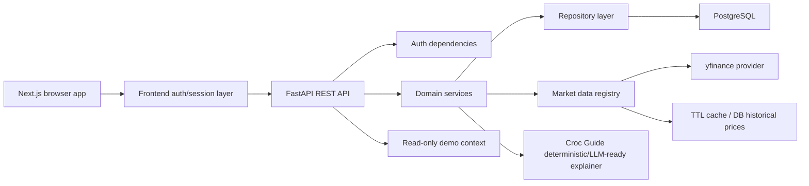

# CrocLens Production MVP Implementation Plan

Last updated: 2026-06-22

## Current-State Findings

CrocLens is a monorepo with a polished beginner-first dashboard, a modular FastAPI backend, a PostgreSQL-oriented SQLAlchemy schema, Alembic migrations, Docker files, and documentation. The strongest existing pieces are the visual design, financial safety language, broad domain model, feature-page structure, and test coverage for mock API contracts.

The app is still mock-heavy in the workflows that matter most for a functional MVP:

- Account signup/login returns `mock_session` tokens and does not verify stored credentials.
- The frontend stores the session in `localStorage`.
- Signup is prefilled with Maya sample data.
- Portfolio summary, assets, action plans, market news, tax, retirement, and assistant responses are shared sample responses.
- The database schema exists, but most API routes do not use database-backed repositories.
- Portfolio holdings and liabilities cannot be created, edited, deleted, or isolated per user.
- Market data is represented by sample data and partial provider scaffolding rather than a connected quote flow for user holdings.
- CI is manual-only and frontend tests are source-file smoke checks rather than behavior tests.

## Mock Versus Real Functionality

| Area | Current behavior | MVP target |
| --- | --- | --- |
| Account signup | Mock response, no persistence | Local persisted auth for development; Cognito-ready production interface |
| Login | Accepts credentials without verification | Password verification, session expiration, protected routes |
| Session storage | Browser `localStorage` | Secure cookie-oriented flow for production; local dev session model |
| Portfolio summary | Shared sample data | Authenticated user-specific persisted holdings/liabilities |
| Holdings | No CRUD vertical slice | Add, edit, delete ticker/quantity holdings |
| Liabilities | Sample-only | Add, edit, delete liabilities affecting net worth |
| Market data | Sample files and partial provider concepts | yfinance provider with normalized quotes, caching, timeouts, limitations |
| Croc Guide | Rule-based sample context | Deterministic explanation grounded in actual user data |
| Demo | Dashboard currently uses sample user data | Explicit read-only recruiter demo mode |
| AWS | Documentation only | Deployment-ready documentation and templates without provisioning |

## Target Architecture

Core rule: API routes stay thin. They validate requests, obtain the current user, and delegate to services. Services own business rules. Repositories own database reads/writes. Provider adapters own external data normalization.

## Database Strategy

Keep PostgreSQL as the production target because the existing schema is relational and financial records need ownership checks, constraints, and transactional updates. Use Alembic for every schema change.

Near-term schema changes:

- Add `password_hash` for `AUTH_MODE=local` users.
- Add `external_auth_subject` and `auth_provider` for Cognito identities.
- Add session or refresh-token metadata for local development sessions.
- Add account tax type and purchase metadata to holdings if missing.
- Ensure cascade behavior and ownership indexes are correct.

Tests may use SQLite for fast local checks where behavior is database-agnostic, but PostgreSQL migrations remain the source of truth.

## Authentication Strategy

Production target is Amazon Cognito with authorization code flow plus PKCE and backend JWT validation. No Cognito resources will be created by this implementation.

MVP/local strategy:

- `AUTH_MODE=local` enables persisted local users.
- Store password hashes only, using bcrypt or Argon2id.
- Never store plaintext passwords.
- Derive user identity from the validated session/JWT, not request bodies.
- Add dependencies: `get_current_user`, `require_current_user`, and `get_optional_user`.
- Return 401 for missing/invalid auth and 403 for cross-user access.

Frontend should move away from `localStorage` toward cookie-based sessions. Until the BFF/cookie layer is complete, any local session behavior must be clearly marked as local development only and disabled for production.

## Data-Provider Strategy

Use a provider abstraction rather than importing yfinance in API routes.

First working provider:

- yfinance for stock/ETF quotes, history, metadata, dividends, and splits where feasible.
- Run blocking provider calls off the FastAPI event loop.
- Add explicit timeouts, bounded retries, input validation, response validation, and TTL caching.
- Label yfinance/Yahoo-derived data as unofficial, delayed or incomplete, and educational only.

Provider responses must include symbol, value, currency, provider, retrieval time, data-as-of time, freshness status, validation status, source, and limitations. No route should invent live financial values when a provider fails.

## AWS Deployment Strategy

Do not deploy or create chargeable resources.

Prepare for a low-complexity AWS path:

- Amplify Hosting for frontend.
- Cognito for auth.
- FastAPI on either Lambda + Mangum or a small container/EC2 path after an ADR.
- EventBridge Scheduler for ingestion only after cost review.
- S3-compatible cache interface for provider artifacts.
- Finite CloudWatch log retention.

Avoid by default: NAT Gateway, RDS provisioning, Application Load Balancer, OpenSearch, ElastiCache, WAF, paid domains, provisioned concurrency, customer-managed KMS keys, Elastic IPs, and multi-AZ databases.

## Security Risks

- Mock sessions and `localStorage` tokens are not production-safe.
- Existing routes do not consistently require a current user.
- Current sample responses can blur demo data and real user data.
- Provider errors could leak raw exception detail if not normalized.
- Financial payloads, passwords, and tokens must be excluded from logs.
- Prompt-injection and direct financial-advice regressions need automated tests.

## Cost Risks

- AWS Free Tier is account-dependent and usage-limited.
- NAT Gateway, RDS, always-on EC2, Load Balancers, OpenSearch, SageMaker/Bedrock endpoints, ElastiCache, high CloudWatch log volume, Route 53 paid domains, and paid market APIs are the main cost traps.
- Deployment must not happen until estimates, budget alerts, and teardown steps are reviewed.

## Ordered Implementation Checklist

1. Add environment-based backend/frontend configuration and safe `.env.example` placeholders.
2. Add structured JSON request logging with redaction boundaries.
3. Add local persisted authentication with password hashing, session validation, and auth dependencies.
4. Add database migrations for auth fields and session metadata.
5. Replace mock account endpoints with local-auth services while preserving future Cognito interfaces.
6. Add protected `/me` and portfolio routes. Completed for local auth and PostgreSQL portfolio records.
7. Implement holdings/liabilities CRUD with repositories and ownership checks. Completed for manual holdings and liabilities.
8. Implement yfinance market-data provider, cache, validation, and normalized metadata.
9. Calculate authenticated user portfolio summary from persisted data.
10. Update dashboard to use authenticated user state, empty states, and mutation dialogs. Partially complete through account-aware dashboard/sidebar state, BFF-backed Portfolio page CRUD, and first-pass empty states; edit dialogs remain.
11. Add read-only public landing page and explicit recruiter demo mode.
12. Ground Croc Guide in authenticated portfolio calculations with safety fields.
13. Replace frontend smoke checks with Vitest/RTL and add Playwright where practical.
14. Expand backend tests for auth, authorization, CRUD, provider failures, and user isolation.
15. Update CI to run on pull requests and pushes to `main`.
16. Add AWS ADR, cost controls, deployment preparation docs, and teardown docs without provisioning resources.
17. Update README, SECURITY, CONTRIBUTING, data freshness, market provider, authentication, and privacy documentation.

## First Checkpoint Scope

The first code checkpoint is deliberately narrow:

- Create `codex/production-mvp`.
- Add this implementation plan.
- Add production-aware configuration fields.
- Add backend JSON logging middleware behavior.
- Update `.env.example`.
- Run the existing backend/frontend validation commands that apply.
- Commit and push the branch.

This gives the project a safer foundation before changing authentication and persistence.
